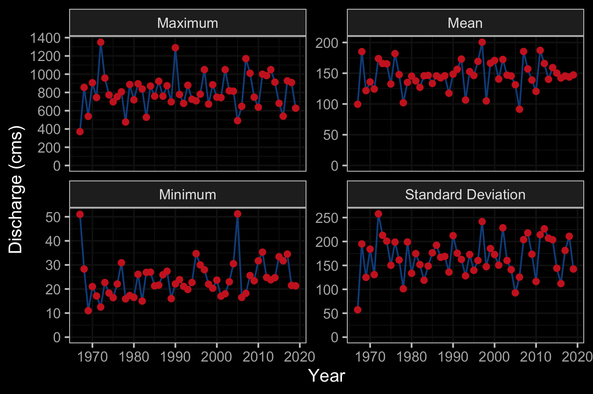

--- 
title: "Restoring Fish Passage in the Peace Region - 2022 - PEA-F23-F-3761-DCA"
author: |
 |
 | Prepared for
 | Fish and Wildlife Compensation Program 
 |       and  
 | Fish Passage Technical Working Group 
 |
 |
 | Prepared by
 | Al Irvine, B.Sc., R.P.Bio. and Mateo Winterscheidt, B.Sc.
 | New Graph Environment Ltd.
 | on behalf of 
 | Society for Ecosystem Restoration in Northern BC

date: |
 |
 | Version 0.0.1 `r format(Sys.Date(), "%Y-%m-%d")`
toc-title: Table of Contents
site: bookdown::bookdown_site
output: 
  bookdown::gitbook:
          includes:
            in_header: header.html
nocite: |

documentclass: book
bibliography: [book.bib, packages.bib, references.bib]
biblio-style: apalike
link-citations: no
github-repo: rstudio/bookdown-demo
description: "Restoring Fish Passage in the Peace Region"


---

```{r switch-gitbook-html, echo=FALSE}
gitbook_on <- TRUE
# gitbook_on <- FALSE  ##we just need turn  this on and off to switch between gitbook and pdf via paged.js

```

```{r setup, echo=identical(gitbook_on, TRUE), include = TRUE}
knitr::opts_chunk$set(echo=identical(gitbook_on, TRUE), message=FALSE, warning=FALSE, dpi=60, out.width = "100%")
# knitr::knit_hooks$set(webgl = hook_webgl)
options(scipen=999)
options(knitr.kable.NA = '--') #'--'
options(knitr.kable.NAN = '--')
```

```{r settings-gitbook, eval= gitbook_on}
photo_width <- "100%"
font_set <- 11

```

```{r settings-paged-html, eval= identical(gitbook_on, FALSE)}
photo_width <- "80%"
font_set <- 9
```


```{r}
source('scripts/packages.R')
source('scripts/tables.R')

```


```{r include=FALSE}
# automatically create a bib database for R packages
knitr::write_bib(c(
  .packages(), 'bookdown', 'knitr', 'rmarkdown'
), 'packages.bib')
```

# Acknowledgement {.front-matter .unnumbered}


Modern civilization has a long journey ahead to acknowledge and address the historic and ongoing impacts of colonialism that have resulted in harm to the cultures and livelihoods living interconnected with our ecosystems for many thousands of years. 


```{js, logo-header, echo = FALSE, eval= T}
title=document.getElementById('header');
title.innerHTML = '' + title.innerHTML
```


<!--chapter:end:index.Rmd-->

# Background

The study area includes the Parsnip River watershed group (Figure \@ref(fig:overview-map)) and is  within the  traditional territories of the Tse'khene First Nations.  

<br>

## Tse'khene

The Parsnip River watershed is located within the south-eastern portion of the 108,000 km^2^ traditional territory of the Tse'khene from the [McLeod Lake Indian Band](https://www.mlib.ca/about/History). The Tse'khene *"People of the Rocks"* are a south westerly extension of the Athabascan speaking people of northern Canada.  They were nomadic hunters whose language belongs to the Beaver-Sarcee-Tse'khene branch of Athapaskan [@HistoryWhoWeAre2023].  Extensive work is underway to preserve the language with resources such as First Voices available [online](https://www.firstvoices.com/explore/FV/sections/Data/Athabascan/Tse'Khene%20(McLeod%20Lake)/Tse'Khene%20(McLeod%20Lake)/learn) and in [app form](https://apps.apple.com/us/app/tsekhene-mcleod-lake/id1503929250) for iphone and ipad devices.

<br>

The continental divide separates watersheds flowing north into the Arctic Ocean via the Mackenzie River and south and west into the Pacific Ocean via the Fraser River (Figure \@ref(fig:overview-map)). The Parsnip River is a 6th order stream with a watershed that drains an area of 5597km^2^. The mainstem of the river flows within the Rocky Mountain Trench in a north direction into Williston Reservoir starting from the continental divide adjacent to Arctic Lakes. Major tributaries include the Misinchinka, Colbourne, Reynolds, Anzac, Table, Hominka and Missinka sub-basins which drain the western slopes of the Hart Ranges of the Rocky Mountains.  The Parsnip River has a mean annual discharge of `r round(fasstr::calc_longterm_mean(station_number = "07EE007")$LTMAD,1)` m^3^/s with flow patterns typical of high elevation watersheds on the west side of the northern Rocky Mountains which receive large amounts of precipitation as snow leading to peak levels of discharge during snowmelt, typically from May to July (Figures \@ref(fig:fig-hydrology-plot-flow) - \@ref(fig:fig-hydrology-plot-stats)).

<br>

Construction of the 183 m high and 2134 m long W.A.C. Bennett Dam was completed in 1967 at Hudson's Hope, BC, creating the Williston Reservoir [@hirst1991Impactsoperations]. Filling of the 375km^2^ reservoir was complete in 1972 and flooded a substantial portion of the Parsnip River and major tributary valleys forming what is now known as the Peace and Parsnip reaches. The replacement of riverine habitat with an inundated reservoir environment resulted in profound changes to the ecology, resource use and human settlement patterns in these systems [@hagen_etal2015Criticalhabitats; @pearce2019FirstNations; @stamford_etal2017FWCPArctic]. Prior to the filling of the reservoir, the Pack River, into which McLeod Lake flows, was a major tributary to the Parsnip River.  The Pack River currently enters the Williston Reservoir directly as the historic location of the confluence of the two rivers lies within the reservoir's footprint.

<br>


## Project Location

```{r overview-map, fig.cap = 'Overview map of Study Area',eval=T}
knitr::include_graphics("fig/overview.jpg")
```


<br>


```{r fig-hydrology-plot-flow, eval = T, fig.dim = c(5.1, 3.4), fig.cap='Parsnip River Above Misinchinka River (Station #07EE007 - Lat 55.08194 Lon -122.913063). Available daily discharge data from 1967 to 2019.'}
# knitr::include_graphics("fig/hydrology1-1.png")  ##left this here in case we want to go back to having this build from scratch.

# img <- png::readPNG("fig/hydrology1.png")
# grid::grid.raster(img)

knitr::include_graphics("fig/hydrograph_07EE007.png")

```

<br>

```{r fig-hydrology-plot-stats, fig.dim = c(5.1, 3.4), fig.cap="Summary discharge statistics (annual maximum, minimum, mean and standard deviation) for Parsnip River at hydrometric station #07EE007."}
# img <- png::readPNG("fig/hydrology2.png")
# grid::grid.raster(img)


```

## Fisheries {-}
Fish species recorded in the Parsnip River watershed are detailed in Table \@ref(tab:fiss-species-table) [@data_fish_obs]. In addition to flooding related to the formation of the Williston Reservoir, transmission lines, gas pipelines, rail, road networks, forestry, elevated water temperatures, interrupted connectivity, invasion from non-native species and insect infestations affecting forested areas pose threats to fisheries values in the Parsnip River watershed  [@hagen_2015_critical_habs; @stamfordFWCPArcticGrayling; @bull_trout_synthesis; @bt_cosewic]. A brief summary of trends and knowledge status related to Arctic grayling, bull trout, kokanee, mountain whitefish and rainbow trout in Williston Watershed streams is provided in @fishandwildlifecompensationprogram2020PeaceRegion with a more detailed review of the state of knowledge for Parsnip River watershed populations of Arctic grayling and bull trout provided below.

<br>


```{r fiss-species-table}
fiss_species_table <- readr::read_csv(paste0(getwd(), '/data/inputs_extracted/fiss_species_table.csv'))

fiss_species_table %>% 
  fpr::fpr_kable(caption_text = 'Fish species recorded in the Parsnip River watershed group.', scroll = gitbook_on)

```


### Bull Trout - sa'ba {-}

Bull Trout populations of the Williston Reservoir watershed are included within the Western Arctic population 'Designatable Unit 10', which, in 2012, received a ranking of ‘Special Concern’ by the Committee on the Status of Endangered Wildlife in Canada [@cosewic2012COSEWICassessment].  They were added to Schedule 1 under the Species of Risk Act in 2019  [@speciesregistrycanada2020BullTrout] and are also considered of special concern (blue-listed) provincially [@bcspeciesecosystemexplorer2020Salvelinusconfluentus]. Some or all of the long-term foot survey index sections of four Williston Reservoir spawning tributaries (Davis Creek, Misinchinka River, Point Creek, and Scott Creek), have been surveyed within 16 of the 19 years between 2001 and 2019 (16 of 19 in Davis River, 10 years over a 13-year period in the Misinchinka River, 11 years over a 14-year period for Point Creek, and 9 years over an 11-year period for Scott Creek [@hagen_etal2020CriticalSpawning]. 

<br>

A study of sa'ba critical habitats in the Parsnip River was conducted in 2014 with the Misinchinka and Anzac systems identified as the most important systems for large bodied bull trout spawners accounting for a combined total of 65% of spawners counted.  The Table River was also highlighted as an important spawning destination accounting for an estimated 15% of the spawners.  Other watersheds identified as containing runs of large bodied bull troutspawners included the Colbourne, Reynolds, Hominka and Missinka River with potentially less than 50 spawners utilizing each sub-basin [@hagen_etal2015Criticalhabitats].  @hagen_weber2019Limitingfactors have synthesized a large body of information regarding limiting factors, enhancement potential, critical habitats and conservation status for bull trout of the Williston Reservoir and the reader is encouraged to review this work for context.  They have recommended experimental enhancements within a monitoring framework for Williston Reservoir bull trout (some spawning and rearing in Parsnip River mainstem and tributaries) which include stream fertilization, side channel development, riparian restoration and fish access improvement.  

<br>

In 2018, sub-basins of the Anzac River watershed, Homininka River, Missinka River and Table River watersheds were designated as fisheries sensitive watersheds under the authority of the *Forest and Range Practices Act* due to significant downstream fisheries values and significant watershed sensitivity [@anzac_sens; @hominka_sens; @table_sens; @missinka_sens]. Special management is required in these watersheds to protect habitat for fish species including bull trout and Arctic grayling including measures (among others) to limit equivalent clearcut area, reduce impacts to natural stream channel morphology, retain old growth attributes and maintain fish habitat/movement [@fsw_order].    

<br>

Tse'khene Elders from the McLeod Lake Indian Band report that sa'ba (bull trout) size and abundance has decreased in all rivers and tributaries from the reservoir with more injured and diseased fish captured in recent history than was common in the past [@pearce2019FirstNations]. 

<br>

### Arctic Grayling - dusk'ihje{-}
A detailed review of dusk'ihje life history can be referenced in @stamfordFWCPArcticGrayling. Since impoundment of the Williston Reservoir, it appears that physical habitat and ecological changes have been the most significant factors limiting Arctic grayling productivity. Although these changes are not well understood they have likely resulted in the inundation of key low gradient juvenile rearing and overwintering habitats, isolation of previously connected populations and increases in abundance of predators such as bull trout [@shrimptonj_m__etal2012Geneticanalysis; @hagenTrendAbundanceArctic2018].  

<br>

Migration of mature adult dusk'ihje (Arctic grayling) occurs in the spring with arrival at known spawning locations coinciding with water temperatures of 4$^\circ$C.  Spawning in the Parsnip watershed appears to occur between late-May and late-June within sites located primarily within the lower reaches of the Anzac and Table rivers as well as within the Parsnip River mainstem. Side-channel and multiple-channel locations containing small gravels appear to be selected for spawning. Currently, the primary distribution of Williston Arctic grayling appears to be among fourth order and larger streams [@williamson_2004; @stamfordFWCPArcticGrayling]. @stewartFishLifeHistory2007 report that Arctic grayling spawn in large and small tributaries to rivers and lakes, intermittent streams, within mainstem rivers as well as lakes, most commonly at tributary mouths.   Although past study results indicate that 0+ grayling appeared to overwinter in lower reaches of larger tributaries (i.e. Table, Anzac rivers) as well as the Parsnip River and that few age-1+ grayling have been sampled in tributaries, habitat use in small tributaries and the extent they are connected with the mainstem habitats of all core areas is not well understood. Between 1995 and 2019, Arctic grayling population monitoring has been conducted in the Table River in nine out of 25 years (8 years for the Anzac) using snorkel surveys.  Results from 2018 are 2019 are intended to contribute to the assessment of the conservation status of the species in the Parsnip Core area [@hagenTrendAbundanceArctic2018].

<br>

Tse'khene Elders from the McLeod Lake Indian Band report that Arctic grayling numbers have declined dramatically since the flooding of the reservoir and that few dusk'ihje (Arctic Grayling) have been caught in the territory in the past 30 years [@pearce2019FirstNations].

<br>

A review of available fisheries data for the Parsnip River watershed stratified by different habitat characteristics can provide insight into which habitats may provide the highest intrinsic value for fish species based on the number of fish captured in those habitats in past assessment work (Figures \@ref(fig:fish-plot-grad) - \@ref(fig:fish-plot-wshed)).  It should be noted however that it should not be assumed that all habitat types have been sampled in a non-biased fashion or that particular sites selected do not have a disproportionate influence on the overall dataset composition (ie. fish salvage sites are often located adjacent to construction sites which are more commonly located near lower gradient stream reaches).


```{r fish-fiss-summary, eval=T}
# fiss_sum <- readr::read_csv(file = paste0(getwd(), '/data/extracted_inputs/fiss_sum.csv'))
fiss_sum_grad <- readr::read_csv(file = paste0(getwd(), '/data/inputs_extracted/fiss_sum_grad.csv'))
fiss_sum_width <- readr::read_csv(file = paste0(getwd(), '/data/inputs_extracted/fiss_sum_width.csv'))
fiss_sum_wshed <- readr::read_csv(file = paste0(getwd(), '/data/inputs_extracted/fiss_sum_wshed.csv')) 
  


# A summary of historical westslope cutthrout trout observations in the Elk River watershed group by average gradient category of associated stream segment is provided in Figure \@ref(fig:fish-wct-bar). Of `r wct_elkr_grad %>% filter(gradient_id == 3) %>% pull(total)` observations, `r wct_elkr_grad %>% filter(gradient_id == 3) %>% pull(Percent) + wct_elkr_grad %>% filter(gradient_id == 5) %>% pull(Percent) + wct_elkr_grad %>% filter(gradient_id == 8) %>% pull(Percent)`% were within stream segments with average gradients ranging from 0 - 8%.  A total of `r wct_elkr_grad %>% filter(gradient_id == 3) %>% pull(Percent)`% of historic observations were within stream segments with gradients between 0 - 3%, `r wct_elkr_grad %>% filter(gradient_id == 5) %>% pull(Percent)`% were within stream segments with gradients ranging from 3 - 5% and `r wct_elkr_grad %>% filter(gradient_id == 5) %>% pull(Percent)`% were within stream segments with gradients between 5 - 8% [@data_fish_obs; @norris2020bcfishobs]. 
```

```{r tab-fish-grad}
my_caption <- 'Summary of historic salmonid observations vs. stream gradient category for the Parsnip River watershed group.'
fiss_sum_grad %>% 
  select(-gradient_id) %>% 
  fpr::fpr_kable(caption_text = my_caption,
                 scroll = gitbook_on)
```


<br>
```{r fish-plot-grad, out.width = photo_width, fig.cap= 'Summary of historic salmonid observations vs. stream gradient category for the Parsnip River watershed group.', eval=T}
##bar graph
plot_grad <- fiss_sum_grad %>% 
  filter(gradient_id != 99) %>% 
  ggplot(aes(x = Gradient, y = Percent)) +
  geom_bar(stat = "identity")+
  facet_wrap(~species_code, ncol = 2)+
  ggdark::dark_theme_bw(base_size = 11)+
  labs(x = "Average Stream Gradient", y = "Occurrences (%)")
plot_grad

```

<br>

```{r tab-fish-width}
my_caption <- 'Summary of historic salmonid observations vs. channel width category for the Parsnip River watershed group.'
fiss_sum_width %>% 
  select(-width_id) %>% 
  fpr::fpr_kable(caption_text = my_caption,
                 scroll = gitbook_on)
```

<br>

```{r fish-plot-width, out.width = photo_width, fig.cap= 'Summary of historic salmonid observations vs. channel width category for the Parsnip River watershed group.', eval=T}
##bar graph
plot_width <- fiss_sum_width %>% 
  filter(!is.na(width_id)) %>%
  ggplot(aes(x = Width, y = Percent)) +
  geom_bar(stat = "identity")+
  facet_wrap(~species_code, ncol = 2)+
  ggdark::dark_theme_bw(base_size = 11)+
  labs(x = "Channel Width", y = "Occurrences (%)")
plot_width
```

<br>

```{r tab-fish-wshed}
my_caption <- 'Summary of historic salmonid observations vs. watershed size category for the Parsnip River watershed group.'
fiss_sum_wshed %>% 
  fpr::fpr_kable(caption_text = my_caption,
                 scroll = gitbook_on)
```


<br>

```{r fish-plot-wshed, out.width = photo_width, fig.cap= 'Summary of historic salmonid observations vs. watershed size category for the Parsnip River watershed group.', eval=T}
plot_wshed <- fiss_sum_wshed %>%
  # filter(!is.na(upstream_area_ha)) %>%
  ggplot(aes(x = Watershed, y = Percent)) +
  geom_bar(stat = "identity")+
  facet_wrap(~species_code, ncol = 2)+
  ggdark::dark_theme_bw(base_size = 11)+
  labs(x = "Watershed Area", y = "Occurrences (%)")+
  theme(axis.text.x=element_text(angle = 45, hjust = 1))
plot_wshed
```


<!--chapter:end:0200-background.Rmd-->

# Methods

Workflows for the project have been classified into planning, fish passage assessments, habitat confirmation assessments, reporting and mapping. All components leveraged `R`, `SQL` or `Python` programming languages to facilitate workflow tracking, collaboration, transparency and continually improving research. Project workflows utilized local and remote `postgreSQL` databases as well as a "snapshot" of select datasets contained within a local `sqlite` database. A data and script repository to facilitate this reporting is located on [Github](https://github.com/NewGraphEnvironment/fish_passage_peace_2022_reporting).  


```{r eval=F}
source('scripts/packages.R')
source('scripts/tables.R')
# or the development version
# devtools::install_github("rstudio/bookdown")
```

## Planning

 
To identify priorities for crossing structure rehabilitation, background literature, fisheries information, PSCIS, and `bcfishpass` [@norris2021smnorrisbcfishpass] outputs were reviewed.  `bcfishpass` is an updated open-source code repository comprised of tools ported over from the `Fish Habitat Model` [@fish_habitat_model] developed by the BC Ministry of Environment along with a number of significant upgrades and new features. Scripts within `bcfishpass` also pull and analyze data using other open-source tools such as `bcdata` [@norris2021smnorrisbcdata], `bcfishobs` [@norris2022smnorrisbcfishobs], and `fwapg` [@norris2021smnorrisfwapg] which serve numerous functions related to open-data access as well as the analysis of the BC Freshwater Atlas, roads, fish and fish habitat in British Columbia.


 
<br>

### Habitat Modelling

`bcfishpass` calculates the average gradient of BC Freshwater Atlas stream network lines at minimum 100m long intervals starting from the downstream end of the streamline segment and working upstream.  The network lines are broken into max gradient categories with new segments created if and when the average slope of the stream line segment exceeds user provided thresholds. For this project, the user provided gradient thresholds used to delineate "potentially accessible habitat" were based on estimated max gradients that salmon (15% - coho and chinook) and steelhead (20%) are likely to be capable of ascending.  

<br>


Through this initiative and other SERN/New Graph led initiatives, the Provincial Fish Passage Remediation Program and connectivity restoration planning by the Canadian Wildlife Federation [@mazany-wright_etal2021BulkleyRiver], `bcfishpass` has been designed to prioritize potential fish passage barriers for assessment or remediation. The software is under continual development and has been designed and constructed by @norris2021smnorrisbcfishpass using sql and python based shell script libraries to generate a simple model of aquatic habitat connectivity. The model identifies natural barriers (ex. steep gradients for extended distances) and hydroelectric dams to classifying the accessibility upstream by fish [@norris2021smnorrisbcfishpass]. On potentially accessible streams, scripts identify known barriers (ex. waterfalls >5m high) and additional anthropogenic features which are primarily road/railway stream crossings (i.e. culverts) that are potentially barriers. To prioritize these features for assessment or remediation, scripts report on how much modelled potentially accessible aquatic habitat the barriers may obstruct. The model can be refined with known fish observations upstream of identified barriers and for each crossing location, the area of lake and wetland habitat upstream, species documented upstream/downstream, an estimate of watershed area (on 2nd order and higher streams), mean annual precipitation weighted to upstream watershed area and channel width can be collated using `bcfishpass`, `fwapg` and `bcfishobs`.  This, information, can be used to provides an indication of the potential quantity and quality of habitat potentially gained should fish passage be restored by comparing to user defined thresholds for the aforementioned parameters. A discussion of the methodology to derive channel width is below.
 
 <br>

Gradient, channel size and stream discharge are key determinants of channel morphology and subsequently fish distribution. High value  rearing, overwintering  and spawning habitat preferred by numerous species/life stages of fish are often located within channel types that have relatively low gradients and large channel widths (also quantified by the amount of flow in the stream).  Following delineation of "potentially accessible habitat", the average gradient of each stream segment within habitat classified as below the 15% and 20% thresholds was calculated and summed within species and life stage specific gradient categories.  Average gradient of stream line segments can be calculated from elevations contained in the provincial freshwater atlas streamline dataset. To obtain estimates of channel width upstream of crossing locations, Where available, `bcfishpass` was utilized to pull average channel gradients from Fisheries Information Summary System (FISS) site assessment data [@moeStreamInventorySample] or PSCIS assessment data [@moe2021PSCISAssessments] and associate with stream segment lines. When both FISS and PSCIS values were associated with a particular stream segment, FISS channel width was used.  When multiple FISS sites were associated with a particular stream segment a mean of the average channel widths was taken.  To model channel width for 2nd order and above stream segments without associated FISS or PSCIS sites, first `fwapg` was used to estimate the drainage area upstream of the segment.  Then, rasters from ClimateBC [@wang_etal2012ClimateWNAHighResolution] were sampled for each stream segments and a mean annual precipitation weighted by upstream watershed area was calculated. Mean annual precipitation was then combined with the channel widths and BEC zone information (gathered through a spatial query tied to the bottom of the stream segment) into a dataset (n = 22990) for analysis fo the relationship between these variables.  The details of this analysis and resulting formula used to estimate channel width on stream segments in the Parsnip Watershed is included as a technical appendix `r if(gitbook_on){knitr::asis_output("[here](https://www.poissonconsulting.ca/f/859859031)")} else knitr::asis_output("at https://www.poissonconsulting.ca/f/859859031")`. 

<br>


`bcfishpass` and associated tools have been designed to be flexible in analysis, accepting user defined gradient, channel width and stream discharge categories [@moeStreamInventorySample].  Although currently in draft form, and subject to development revisions, gradient and channel width thresholds for habitat with the highest intrinsic value for a number of fish species in the Parsnip River watershed group have been specified and applied to model habitat upstream of stream crossing locations with the highest intrinsic value (Table \@ref(tab:tab-fish-spawning-rearing)).  Definitions of modelling outputs for bull trout are presented in Table \@ref(tab:tab-bcfp-def).  Modelling of habitat for Arctic grayling, kokannee and rainbow trout in the Peace region are planned for 2022/2023 wtih the work leveraging multiple other initiatives underway by SERNbc and others throughout British Columbia.


`r if(gitbook_on){knitr::asis_output("<br>")} else knitr::asis_output("<br><br><br>")`


```{r tab-fish-spawning-rearing}
#`r if(identical(gitbook_on, FALSE)){knitr::asis_output("<br><br><br>")}`
bcfishpass_spawn_rear_model %>% 
  filter(species_code %in% c('BT', 'RB', 'GR', 'KO')) %>% 
  mutate(Species = fishbc::fbc_common_name(species_code), 
         spawn_gradient_max = round(spawn_gradient_max * 100 ,1),
         rear_gradient_max = round(rear_gradient_max * 100 ,1)) %>%
  select(Species, 
         `Spawning Gradient  Max (%)`= spawn_gradient_max,
         `Spawning Width Min (m)` = spawn_channel_width_min,
         # `Spawning Width Max (m)` = spawn_channel_width_max,
         # `Spawning MAD Min (m3/s)` = spawn_mad_min,
         # `Spawning MAD Max (m3/s)` = spawn_mad_max,
         `Rearing Gradient Max (%)` = rear_gradient_max,
         `Rearing Width Min (m)` = rear_channel_width_min) %>% 
         # `Rearing MAD Min (m3/s)` = rear_mad_min,
         # `Rearing MAD Max (m3/s)` = rear_mad_max,
         # `Rearing Wetland Multiplier` = rear_wetland_multiplier,
         # `Rearing Lake Multiplier` = rear_lake_multiplier) %>% 
  t() %>% 
  as_tibble(rownames = "row_names") %>% 
  janitor::row_to_names(row_number = 1) %>% 
  rename(Variable = Species) %>% 
  fpr::fpr_kable(caption_text = 'Stream gradient and channel width thresholds used to model potentially highest value fish habitat.', scroll = F)

```

<br>

```{r tab-fish-spawning-rearing-references}
# bcfishpass_spawn_rear_model_references <- readr::read_csv(file = 'data/width_modelling/model_spawning_rearing_habitat.csv')
bcfishpass_spawn_rear_model_references <- readr::read_csv(file = 'data/inputs_raw/model_spawning_rearing_habitat.csv') 
  # select(species_code, contains('ref'), -contains(c('multiplier','mad')))
  
bcfishpass_spawn_rear_model_references %>% 
  mutate(Species = fishbc::fbc_common_name(species_code)) %>% 
  select(Species, 
         `Spawning Gradient  Max (%)`= spawn_gradient_max,
         `Spawning Width Min (m)` = spawn_channel_width_min,
         # `Spawning Width Max (m)` = spawn_channel_width_max_ref,
         # `Spawning MAD Min (m3/s)` = spawn_mad_min,
         # `Spawning MAD Max (m3/s)` = spawn_mad_max,
         `Rearing Gradient Max (%)` = rear_gradient_max) %>% 
         # `Rearing Wetland Multiplier` = rear_wetland_multiplier,
         # `Rearing Lake Multiplier` = rear_lake_multiplier) %>% 
         # `Rearing MAD Min (m3/s)` = rear_mad_min,
         # `Rearing MAD Max (m3/s)` = rear_mad_max) %>% 
  t() %>% 
  as_tibble(rownames = "row_names") %>% 
  janitor::row_to_names(row_number = 1) %>% 
  rename(Variable = Species) %>% 
  fpr::fpr_kable(caption_text = 'References for stream gradient and channel width thresholds used to model potentially highest value fish habitat. Preliminary and subject to revisions.', scroll = F)
```


<br>

```{r tab-bcfp-def, eval = T}
xref_bcfishpass_names %>% 
  filter(report %like% 'BT') %>% 
  arrange(id_join) %>%  
  select(Attribute = report, Definition = column_comment) %>% 
  fpr::fpr_kable(caption_text = 'bcfishpass outputs and associated definitions',
                 footnote_text = 'Bull trout model uses a gradient threshold of maximum 25% to determine if access if likely possible',
                 scroll = gitbook_on)
```


```{r tablethreshaverage, eval= F}
#to quantify upstream habitat potentially available for salmonids and facilitate stream line symbology based on stream morphology.
# while high gradient sections typically  present  upstream  migration  barriers  and  less  available  habitat.  Additionally, the size of the stream (indicated by channel width) is an important determinant for habitat suitability for different species as well as specific life stages of those species. 

# `bcfishpass` was used to categorize and sum potentially accessible stream segments in the study area watersheds within gradient and width categories for each stream segment. 
# (0 - 3%, 3 - 5%, 5 - 8%, 8 - 15%, 15 - 20%) with these outputs further amalgamated to summarize and symbolize potential upstream habitat in three categories: riffle/cascade (0 - 5%), step-pool (5 - 15%) and step-pool very steep (15-20%) (Table \@ref(tab:tablethreshaverage)).  


#threshold and average gradient table
table_thresh_average <- tibble::tibble(`Gradient` = c('0 - 5%', '5 - 15%', '15 - 20%', '>20%'),
                                       `Channel Type` = c('Riffle and cascade pool', 'Step pool', 'Step pool - very steep', 'Non fish habitat'))

table_thresh_average %>% 
    fpr::fpr_kable(caption_text = 'Stream gradient categories (threshold and average) and associated channel type.')

```


<br>


## Fish Passage Assessments

In the field, crossings prioritized for follow-up were first assessed for fish passage following the procedures outlined in “Field Assessment for Determining Fish Passage Status of Closed Bottomed Structures” [@fish_passage_assessments]. Crossings surveyed included closed bottom structures (CBS), open bottom structures (OBS) and crossings considered “other” (i.e. fords).  Photos were taken at surveyed crossings and when possible included images of the road, crossing inlet, crossing outlet, crossing barrel, channel downstream and channel upstream of the crossing and any other relevant features.  The following information was recorded for all surveyed crossings: date of inspection, crossing reference, crew member initials, Universal Transverse Mercator (UTM) coordinates, stream name, road name and kilometer, road tenure information, crossing type, crossing subtype, culvert diameter or span for OBS, culvert length or width for OBS.  A more detailed “full assessment” was completed for all closed bottom structures and included the following parameters: presence/absence of continuous culvert embedment (yes/no), average depth of embedment, whether or not the culvert bed resembled the native stream bed, presence of and percentage backwatering, fill depth, outlet drop, outlet pool depth, inlet drop, culvert slope, average downstream channel width, stream slope, presence/absence of beaver activity, presence/absence of fish at time of survey, type of valley fill, and a habitat value rating.  Habitat value ratings were based on channel morphology, flow characteristics (perennial, intermittent, ephemeral), fish migration patterns, the presence/absence of deep pools, un-embedded boulders, substrate, woody debris, undercut banks, aquatic vegetation and overhanging riparian vegetation (Table \@ref(tab:tab-hab-value)).  For crossings determined to be potential barriers or barriers based on the data (see [Barrier Scoring]), a culvert fix and recommended diameter/span was proposed.  

<br>


 
```{r tab-hab-value}
fpr_table_habvalue %>% 
  knitr::kable(caption = 'Habitat value criteria (Fish Passage Technical Working Group, 2011).', booktabs = T) %>% 
    kableExtra::column_spec(column = 1, width_min = '1.5in') %>% 
    kableExtra::kable_styling(c("condensed"), full_width = T, font_size = font_set) 
  
```
 
`r if(gitbook_on){knitr::asis_output("<br>")} else knitr::asis_output("\\pagebreak")`

### Barrier Scoring

Fish passage potential was determined for each stream crossing identified as a closed bottom structure as per @fish_passage_assessments.  The combined scores from five criteria: depth and degree to which the structure is embedded, outlet drop, stream width ratio, culvert slope, and culvert length were used to screen whether each culvert was a likely barrier to some fish species and life stages (Table \@ref(tab:tab-barrier-scoring), Table \@ref(tab:tab-barrier-result). These criteria were developed based on data obtained from various studies and reflect an estimation for the passage of a juvenile salmon or small resident rainbow trout [@clarkinNationalInventoryAssessment2005 ;@bellFisheriesHandbookEngineering1991; @thompsonAssessingFishPassage2013].  

<br>

```{r tab-barrier-scoring, eval=T}
tab <- as_tibble(t(fpr_table_barrier_scoring)) %>% 
  mutate(V4 = names(fpr_table_barrier_scoring)) %>% 
  select(V4, everything()) %>% 
  janitor::row_to_names(1) %>%  ##turn the table sideways
  mutate(Risk = case_when(Risk == 'Value' ~ '  Value',
                          T ~ Risk))

tab %>% 
  fpr::fpr_kable(caption_text = 'Fish Barrier Risk Assessment (MoE 2011).', scroll = F)

```

<br>


```{r tab-barrier-result}
fpr_table_barrier_result %>% 
  fpr::fpr_kable(caption_text = 'Fish Barrier Scoring Results (MoE 2011).', scroll = F) 

```

<br>

### Cost Benefit Analysis

A cost benefit analysis was conducted for each crossing determined to be a barrier based on an estimate of cost associated with remediation or replacement of the crossing with a structure that facilitates fish passage and the amount of potential habitat that would be made available by remediating fish passage at the site (habitat gain index).  

<br>

#### Habitat Gain Index

The habitat gain index is the quantity of modelled habitat upstream of the subject crossing and represents an estimate of habitat gained with remediation of fish passage at the crossing.  For this project, a gradient threshold between accessible and non-accessible habitat was set at 20% (for a minimimum length of 100m) intended to represent the maximum gradient of which the strongest swimmers of anadromous species (bull trout) are likely to be able to migrate upstream.  

<br>

For reporting of Phase 1 - fish passage assessments within the body of this report (Table \@ref(tab:tab-barrier-scoring)), a "total" value of habitat <20% output from `bcfishpass` was used to estimate the amount of habitat upstream of each crossing less than 20% gradient before a falls of height >5m - as recorded in @ProvincialObstaclesFish or documented in other `bcfishpass` online documentation. For Phase 2 - habitat confirmation sites, conservative estimates of the linear quantity of habitat to be potentially gained by fish passage restoration, bull trout rearing maximum gradient threshold (7.4%) was used.  To generate areas of habitat upstream, the estimated linear length was multiplied by half the downstream channel width measured (overall triangular channel shape) as part of the fish passage assessment protocol.  Although these estimates are not generally conservative, have low accuracy and do not account for upstream stream crossing structures they allow a rough idea of the best candidates for follow up. 


<br>


Potential options to remediate fish passage were selected from @fish_passage_assessments and included:  

 + Removal (RM) - Complete removal of the structure and deactivation of the road. 
 + Open Bottom Structure (OBS) - Replacement of the culvert with a bridge or other open bottom structure.  Based on consultation with FLNR road crossing engineering experts, for this project we considered bridges as the only viable option for OBS type .  
 + Streambed Simulation (SS) - Replacement of the structure with a streambed simulation design culvert.  Often achieved by embedding the culvert by 40% or more. Based on consultation with FLNR engineering experts, we considered crossings on streams with a channel width of <2m and a stream gradient of <8% as candidates for replacement with streambed simulations.
 + Additional Substrate Material (EM) - Add additional substrate to the culvert and/or downstream weir to embed culvert and reduce overall velocity/turbulence.  This option was considered only when outlet drop = 0, culvert slope <1.0% and stream width ratio < 1.0.
 + Backwater (BW) - Backwatering of the structure to reduce velocity and turbulence. This option was considered only when outlet drop < 0.3m, culvert slope <2.0%, stream width ratio < 1.2 and stream profiling indicates it would be effective..
 
 <br>

Cost estimates for structure replacement with bridges and embedded culverts were generated based on the channel width, slope of the culvert, depth of fill, road class and road surface type. Road details were sourced from @flnrordForestTenureRoad2020 and @flnrordDigitalRoadAtlas2020 through `bcfishpass`. Interviews with Phil MacDonald, Engineering Specialist FLNR - Kootenay, Steve Page, Area Engineer - FLNR - Northern Engineering Group and Matt Hawkins - MoTi - Design Supervisor for Highway Design and Survey - Nelson were utilized to helped refine estimates.  

<br>

Base costs for installation of bridges on forest service roads and permit roads with surfaces specified in provincial GIS road layers as rough and loose was estimated at \$12500/linear m and assumed that the road could be closed during construction and a minimum bridge span of 10m. For streams with channel widths <2m, embedded culverts were reported as an effective solution with total installation costs estimated at $25k/crossing (pers. comm. Phil MacDonald, Steve Page). For larger streams (>6m), span width increased proportionally to the size of the stream (ex. for an 8m wide stream a 12m wide span was prescribed).  For crossings with large amounts of fill (>3m), the replacement bridge span was increased by an additional 3m for each 1m of fill >3m to account for cutslopes to the stream at a 1.5:1 ratio. To account for road type, a multiplier table was also generated to estimate incremental cost increases with costs estimated for structure replacement on paved surfaces, railways and arterial/highways costing up to 20 times more than forest service roads due to expenses associate with design/engineering requirements, traffic control and paving.  The cost multiplier table (Table \@ref(tab:tab-cost-mult)) should be considered very approximate with refinement recommended for future projects.  

`r if(gitbook_on){knitr::asis_output("<br>")} else knitr::asis_output("\\pagebreak")`

```{r tab-cost-mult, eval = F}
tab_cost_rd_mult_report %>%
  fpr::fpr_kable(caption_text = 'Cost multiplier table based on road class and surface type.', scroll = F)
```

<br>

## Habitat Confirmation Assessments

Following fish passage assessments, habitat confirmations were completed in accordance with procedures outlined in the document “A Checklist for Fish Habitat Confirmation Prior to the Rehabilitation of a Stream Crossing” [@confirmation_checklist_2011]. The main objective of the field surveys was to document upstream habitat quantity and quality and to determine if any other obstructions exist above or below the crossing.  Habitat value was assessed based on channel morphology, flow characteristics (perennial, intermittent, ephemeral), the presence/absence of deep  pools, un-embedded  boulders, substrate, woody debris, undercut banks, aquatic vegetation and overhanging riparian vegetation. Criteria used to rank habitat value was based on guidelines in @confirmation_checklist_2011 (Table \@ref(tab:tab-hab-value)). 

<br>

During habitat confirmations, to standardize data collected and facilitate submission of the data to provincial databases, information was collected on ["Site Cards"](https://www2.gov.bc.ca/gov/content/environment/natural-resource-stewardship/laws-policies-standards-guidance/inventory-standards/aquatic-ecosystems). Habitat characteristics recorded included channel widths, wetted widths, residual pool depths, gradients, bankfull depths, stage, temperature, conductivity, pH, cover by type, substrate and channel morphology (among others). When possible, the crew surveyed downstream of the crossing to the point where fish presence had been previously confirmed and upstream to a minimum distance of 600m. Any  potential  obstacles  to  fish  passage  were  inventoried  with  photos, physical  descriptions  and  locations  recorded on site cards.  Surveyed routes were recorded with time-signatures on handheld GPS units.   

<br>

Fish sampling was conducted on a subset of sites when biological data was considered to add significant value to the physical habitat assessment information. When possible, electrofishing was utilized within discrete site units both upstream and downstream of the subject crossing with electrofisher settings, water quality parameters (i.e. conductivity, temperature and ph), start location, length of site and wetted widths (average of a minimum of three) recorded.  For each fish captured, fork length and species was recorded, with results included within the fish data submission spreadsheet.  Fish information and habitat data will be submitted to the province under scientific fish collection permit CB20-611971.

<br>

\pagebreak

## Reporting

Reporting was generated with `bookdown` [@bookdown2016] from `Rmarkdown` [@R-rmarkdown] with primarily `R` [@rcoreteam2022languageenvironment] and `SQL` scripts. The `R` package `fpr` contains many specialized custom functions related to the work [@irvine2022NewGraphEnvironmentfpr].  In addition to numerous spatial layers sourced through the BC Data Catalogue then stored and queried in a local `postgresql` and `sqlite` databases [data inputs](https://github.com/NewGraphEnvironment/fish_passage_peace_2022_reporting/tree/main/data) for this project include: 

 + Populated [Fish Data Submission Spreadsheet Template - V 2.0, January 20, 2020 ](https://www2.gov.bc.ca/gov/content/environment/plants-animals-ecosystems/fish/fish-and-fish-habitat-data-information/fish-data-submission/submit-fish-data#submitfish) 

 + Populated [pscis_assessment_template_v24.xls](https://www2.gov.bc.ca/gov/content/environment/plants-animals-ecosystems/fish/aquatic-habitat-management/fish-passage/fish-passage-technical/assessment-projects)
 
 
 + [`bcfishpass`](https://github.com/smnorris/bcfishpass) outputs.


 + [Custom CSV file](https://github.com/NewGraphEnvironment/fish_passage_peace_2022_reporting/blob/main/data/habitat_confirmations_priorities.csv) detailing Phase 2 site:
     - priority level for proceeding to design for replacement
     - length of survey upstream and downstream
     - a conservative estimate of the linear length of mainstem habitat potentially available upstream of the crossing 
     - fish species confirmed as present upstream of the crossing

 + [GPS tracks](https://github.com/NewGraphEnvironment/fish_passage_peace_2022_reporting/blob/main/data/habitat_confirmation_tracks.gpx) from field surveys.  

 + [Photos](https://github.com/NewGraphEnvironment/fish_passage_peace_2022_reporting/tree/main/data/photos) and photo metadata

<br>

Version changes are tracked [here](https://github.com/NewGraphEnvironment/fish_passage_peace_2022_reporting/blob/main/NEWS.md) and issues/planned enhancements tracked [here](https://github.com/NewGraphEnvironment/fish_passage_peace_2022_reporting/issues). 


## Mapping

Mapping was completed by Hillcrest Geographics.  `pdf` maps were generated using `QGIS` with data supplied via a `postgreSQL` database.  A QGIS layer file defining and symbolizing all layers required for general fish passage mapping was developed and at the time of reporting was kept under version control within `bcfishpass`.
 

 


<!--chapter:end:0300-methods.Rmd-->

# Appendix - Phase 1 Fish Passage Assessment Data and Photos {-}

`r knitr::knit(text = mapply(fpr::fpr_table_cv_detailed_print,  tab_sum = tab_summary, comments = tab_summary_comments, photos = tab_photo_url))`

`r if(gitbook_on){knitr::asis_output("")} else knitr::asis_output("\\pagebreak")`

<!--chapter:end:0600-appendix.Rmd-->

---
output: html_document
editor_options: 
  chunk_output_type: console
  markdown: 
    wrap: 72
---

```{r setup-125000, eval = F}
knitr::opts_chunk$set(echo=FALSE, message=FALSE, warning=FALSE)
source('scripts/packages.R')
source('scripts/tables.R')

```

```{r  load-data-125000}
my_site <- 125000

```

`r fpr::fpr_appendix_title()`

## Site Location {.unnumbered}

PSCIS crossing `r as.character(my_site)` is located on
`r fpr::fpr_my_pscis_info()`, on
`r fpr_my_pscis_info(col_pull = road_name)`.

<br>

## Background {.unnumbered}

At crossing `r as.character(my_site)`, `r fpr::fpr_my_pscis_info()` is a
`r fpr::fpr_my_bcfishpass() %>% english::ordinal()` order stream with a
watershed area upstream of the crossing of approximately
`r fpr::fpr_my_wshd()`km^2^. The elevation of the watershed ranges from
a maximum of `r fpr::fpr_my_wshd(col = 'elev_max')`m to
`r fpr::fpr_my_wshd(col = 'elev_min')`m near the crossing (Table
\@ref(tab:tab-wshd-125000)). Upstream of crossing
`r as.character(my_site)`, `r fpr::fpr_my_fish_sp()` have previously
been recorded [@moe2020; @norris2022].

<br>

```{r tab-wshd-125000, eval = T}
fpr::fpr_table_wshd_sum(site_id = my_site) %>% 
  fpr::fpr_kable(caption_text = paste0('Summary of derived upstream watershed statistics for PSCIS crossing ', my_site, '.'),
           footnote_text = 'Elev P60 = Elevation at which 60% of the watershed area is above',
           scroll = F)

```

A map of the watershed is provided in map attachment [93I.111](https://hillcrestgeo.ca/outgoing/fishpassage/projects/parsnip/archive/2022-05-27/FishPassage_093I.111.pdf).

<br>

```{r tab-culvert-bcfp-125000, eval = T}
fpr::fpr_table_bcfp(scroll = gitbook_on) 
```

<br>

## Stream Characteristics at Crossing {.unnumbered}

At the time of the survey, PSCIS crossing `r as.character(my_site)` was
un-embedded, non-backwatered and ranked as a
`r fpr::fpr_my_pscis_info(col_pull = barrier_result) %>% stringr::str_to_lower()`
to upstream fish passage according to the provincial protocol
[@moe2011] (Table \@ref(tab:tab-culvert-125000)).

`r if(identical(gitbook_on, FALSE)){knitr::asis_output("\\pagebreak")}`
<br>

```{r tab-culvert-125000, eval = T}
fpr::fpr_table_cv_summary_memo()

```

## Aerial Imagery {.unnumbered}

In 2019 a video survey was conducted by drone and can be viewed [here](https://www.youtube.com/watch?v=-foWvX1MSkg). In the summer of 2022 additional surveys were conducted with resulting images stitched into an orthomosaic and 3-dimensional model. Surveys were conducted with a remotely piloted aircraft at the crossing with resulting images stitched into an orthomosaic and 3-dimensional model `r if(gitbook_on){knitr::asis_output(" presented in Figures \\@ref(fig:ortho-caption-arctic) - \\@ref(fig:model-caption-arctic).")} else knitr::asis_output("presented [here](https://www.mapsmadeeasy.com/maps/public/0b96f06f52be467db7250b3caeeecee3) and [here](https://www.mapsmadeeasy.com/maps/public_3D/0b96f06f52be467db7250b3caeeecee3/).")`

```{r ortho-arctic, eval = identical(gitbook_on, TRUE)}
model_url <- '<iframe src="https://www.mapsmadeeasy.com/maps/public/0b96f06f52be467db7250b3caeeecee3" scrolling="no" title="Maps Made Easy" width="80%" height="400" frameBorder ="0"></iframe>'

knitr::asis_output(model_url)
```


```{r ortho-caption-arctic, fig.cap= my_caption, out.width = "0.01%", eval = identical(gitbook_on, TRUE)}
my_photo = 'fig/pixel.png'

my_caption = paste0('Orthomosaic of site of planned bridge on tributary to Parsnip River. To zoom press "shift" and scroll.')

knitr::include_graphics(my_photo, dpi = NA)

```

<br>

```{r model-arctic, eval = identical(gitbook_on, TRUE)}
model_url <- '<iframe src="https://www.mapsmadeeasy.com/maps/public_3D/0b96f06f52be467db7250b3caeeecee3" scrolling="no" title="Maps Made Easy" width="80%" height="400" frameBorder ="0"></iframe>'

knitr::asis_output(model_url)
```


```{r model-caption-arctic, fig.cap= my_caption, out.width = "0.01%", eval = identical(gitbook_on, TRUE)}
my_photo = 'fig/pixel.png'

my_caption = paste0('3D model of crossing 125000 where newly installed bridge is planned on a tributary to Parsnip River. To zoom press "shift" and scroll.')

knitr::include_graphics(my_photo, dpi = NA)

```

## Fish Sampling {.unnumbered}

Electrofishing was conducted with results summarised in Tables
\@ref(tab:tab-fish-site-125000) - \@ref(tab:tab-fish-dens-125000) and
Figure \@ref(fig:plot-fish-box-125000).

<br>

## Conclusion {.unnumbered}

Modelling indicates 
`r fpr::fpr_my_priority_info(col_pull= upstream_habitat_length_m)`km of
habitat upstream of crossing `r as.character(my_site)` suitable for bull trout rearing with
areas surveyed rated as
`r fpr::fpr_my_priority_info(sit = my_site, loc = 'us', col_pull = hab_value)`
value for rearing and spawning. Crossing
`r as.character(my_site)` was ranked as a
`r fpr::fpr_my_priority_info(col_pull = priority)` priority for
proceeding to design for replacement.  

`r if(gitbook_on){knitr::asis_output("<br>")} else knitr::asis_output("\\pagebreak")`

<br>

```{r tab-fish-site-125000, eval=T}
fpr_table_fish_site()

```

<br>

```{r tab-fish-dens-125000, eval=T}
fpr_table_fish_density()

```

`r if(gitbook_on){knitr::asis_output("<br>")} else knitr::asis_output("\\pagebreak")`

```{r plot-fish-box-125000, fig.cap= my_caption, eval=T}
my_caption <- paste0('Densites of fish (fish/100m2) captured upstream of PSCIS crossing ', my_site, '.')

fpr_plot_fish_box() 

```

<!--chapter:end:0800-appendix-125000-trib-to-parsnip.Rmd-->

# Tributary to Missinka River - 125179 {-}

```{r  load-data-125179}
my_site <- 125179
```

A map of the watershed is provided in map attachment [93I.117](https://hillcrestgeo.ca/outgoing/fishpassage/projects/parsnip/archive/2022-05-27/FishPassage_093I.116.pdf).

<br>

`r if(gitbook_on){knitr::asis_output(" presented in Figures \\@ref(fig:ortho-caption-missinka) - \\@ref(fig:model-caption-missinka).")} else knitr::asis_output("presented [here](https://www.mapsmadeeasy.com/maps/public/8e3a0c68656c4480a66e067a6e14c0d3) and [here](https://www.mapsmadeeasy.com/maps/public_3D/8e3a0c68656c4480a66e067a6e14c0d3/).")`

```{r ortho-missinka, eval = identical(gitbook_on, TRUE)}
model_url <- '<iframe src="https://www.mapsmadeeasy.com/maps/public/8e3a0c68656c4480a66e067a6e14c0d3" scrolling="no" title="Maps Made Easy" width="80%" height="400" frameBorder ="0"></iframe>'

knitr::asis_output(model_url)
```


```{r ortho-caption-missinka, fig.cap= my_caption, out.width = "0.01%", eval = identical(gitbook_on, TRUE)}
my_photo = 'fig/pixel.png'

my_caption = paste0('Orthomosaic of bridge on Tributary to Missinka River. To zoom press "shift" and scroll.')

knitr::include_graphics(my_photo, dpi = NA)

```

<br>

```{r model-missinka, eval = identical(gitbook_on, TRUE)}
model_url <- '<iframe src="https://www.mapsmadeeasy.com/maps/public_3D/8e3a0c68656c4480a66e067a6e14c0d3" scrolling="no" title="Maps Made Easy" width="80%" height="400" frameBorder ="0"></iframe>'

knitr::asis_output(model_url)
```


```{r model-caption-missinka, fig.cap= my_caption, out.width = "0.01%", eval = identical(gitbook_on, TRUE)}
my_photo = 'fig/pixel.png'

my_caption = paste0('3D model of newly installed bridge on a tributary to Missinka Creek. To zoom press "shift" and scroll.')

knitr::include_graphics(my_photo, dpi = NA)

```

<br>


```{r photo-125197-01-prep, eval=T}
my_photo1 = fpr::fpr_photo_pull_by_str(site = 1251792019, str_to_pull = 'crossing_all')

my_caption1 = paste0('Photos of crossing ', my_site, ' in 2019.')


```

```{r photo-125197-01, fig.cap= my_caption1, out.width = photo_width, eval=gitbook_on}
grid::grid.raster(jpeg::readJPEG(my_photo1))
```

<br>

```{r photo-125197-02-prep}
my_photo2 = fpr::fpr_photo_pull_by_str(str_to_pull = 'crossing_all', site = 125179)

my_caption2 = paste0('Photos of crossing ', my_site, ' in 2022.')
```

```{r photo-125197-02, fig.cap= my_caption2, out.width = photo_width, eval=gitbook_on}
grid::grid.raster(jpeg::readJPEG(my_photo2))

```

<br>

```{r photo-125197-d01, fig.cap = my_caption, fig.show="hold", out.width= c("49.5%","1%","49.5%"), eval=identical(gitbook_on, FALSE)}

my_caption <- paste0('Left: ', my_caption1, ' Right: ', my_caption2)

knitr::include_graphics(my_photo1)
knitr::include_graphics("fig/pixel.png")
knitr::include_graphics(my_photo2)
```


<!--chapter:end:0800-appendix-125179-trib-to-missinka.Rmd-->

---
output: html_document
editor_options: 
  chunk_output_type: console
  markdown: 
    wrap: 72
---

```{r setup-125194, eval = F}
knitr::opts_chunk$set(echo=FALSE, message=FALSE, warning=FALSE)
source('scripts/packages.R')
source('scripts/tables.R')

```

```{r  load-data-125194}
my_site <- 125194

```

`r fpr::fpr_appendix_title()`

## Site Location {.unnumbered}

PSCIS crossing `r as.character(my_site)` is located on
`r fpr::fpr_my_pscis_info()`, on
`r fpr_my_pscis_info(col_pull = road_name)`.
The site is approximately
`r round(fpr::fpr_my_bcfishpass(col_pull = downstream_route_measure)*0.001, 1)`km
upstream from the confluence with the Missinka River.

<br>

## Background {.unnumbered}

At crossing `r as.character(my_site)`, `r fpr::fpr_my_pscis_info()` is a
`r fpr::fpr_my_bcfishpass() %>% english::ordinal()` order stream with a
watershed area upstream of the crossing of approximately
`r fpr::fpr_my_wshd()`km^2^. The elevation of the watershed ranges from
a maximum of `r fpr::fpr_my_wshd(col = 'elev_max')`m to
`r fpr::fpr_my_wshd(col = 'elev_min')`m near the crossing (Table
\@ref(tab:tab-wshd-125194)). Upstream of crossing
`r as.character(my_site)`, `r fpr::fpr_my_fish_sp()` have previously
been recorded [@moe2020; @norris2022].

<br>

```{r tab-wshd-125194, eval = T}
fpr::fpr_table_wshd_sum(site_id = my_site) %>% 
  fpr::fpr_kable(caption_text = paste0('Summary of derived upstream watershed statistics for PSCIS crossing ', my_site, '.'),
           footnote_text = 'Elev P60 = Elevation at which 60% of the watershed area is above',
           scroll = F)

```

<br>

A summary of habitat modelling outputs is presented in Table
\@ref(tab:tab-culvert-bcfp-125194) and a map of the watershed is
provided in map attachment
[`r fpr::fpr_my_bcfishpass(col_pull = dbm_mof_50k_grid)`](fpr::fpr_my_mapsheet()).

<br>

```{r tab-culvert-bcfp-125194, eval = T}
fpr::fpr_table_bcfp(scroll = gitbook_on) 
```

<br>

## Stream Characteristics at Crossing {.unnumbered}

At the time of the survey, PSCIS crossing `r as.character(my_site)` was
un-embedded, non-backwatered and ranked as a
`r fpr::fpr_my_pscis_info(col_pull = barrier_result) %>% stringr::str_to_lower()`
to upstream fish passage according to the provincial protocol
[@moe2011] (Table \@ref(tab:tab-culvert-125194)). Water
temperature was
`r fpr::fpr_my_habitat_info(col_pull = 'temperature_c')`$^\circ$C, pH
was `r fpr::fpr_my_habitat_info(col_pull = 'p_h')` and conductivity was
`r fpr::fpr_my_habitat_info(col_pull = 'conductivity_m_s_cm')`uS/cm.

`r if(identical(gitbook_on, FALSE)){knitr::asis_output("\\pagebreak")}`
<br>

```{r tab-culvert-125194, eval = T}
fpr::fpr_table_cv_summary_memo()

```

```{r eval=F}
##this is useful to get some comments for the report
hab_site %>% filter(site == my_site & location == 'ds') %>% pull(comments)
hab_site %>% filter(site == my_site & location == 'us') %>% pull(comments)

```

## Stream Characteristics Downstream {.unnumbered}

`r fpr_my_survey_dist(loc = 'ds')`
`r if(gitbook_on){knitr::asis_output("(Figures \\@ref(fig:photo-125194-01) - \\@ref(fig:photo-125194-02)).")}else(knitr::asis_output("(Figure \\@ref(fig:photo-125194-d01))."))`
`r fpr_my_habitat_paragraph(loc = 'ds')` There was abundant woody debris that added complexity to the stream habitat and provided cover for resident fish. There were trace undercut banks and pools that were suitable for rearing. Abundant gravels were present that would be suitable for spawning. The habitat
was rated as `r fpr::fpr_my_priority_info(loc = 'ds')` value for
salmonid rearing and spawning.

## Stream Characteristics Upstream {.unnumbered}

`r fpr_my_survey_dist(loc = 'us')` `r if(gitbook_on){knitr::asis_output("(Figures \\@ref(fig:photo-125194-03) - \\@ref(fig:photo-125194-06)).")}else(knitr::asis_output("(Figure \\@ref(fig:photo-125194-d02))."))`
`r fpr_my_habitat_paragraph(loc = 'us')` The water was tinged brown at the time of survey; likely from beaver activity upstream. No gravels were present suitable for spawning and the substrate was composed primarily of angular rock. Several rock steps of 50-60cm high were present in first 300m of survey that would prevent upstream juvenile salmonid migration. Large beaver dam and empoundment at modelled crossing 16601526. Overall, the habitat surveyed upstream of the crossing
rated as `r fpr::fpr_my_priority_info(loc = 'us')` value as an important
migration corridor containing habitat suitable for spawning with moderate rearing potential.

<br>

## Structure Remediation and Cost Estimate {.unnumbered}

## Conclusion {.unnumbered}

Modelling indicates 
`r fpr::fpr_my_priority_info(col_pull= upstream_habitat_length_m)`km of
habitat upstream of crossing `r as.character(my_site)` suitable for bull trout rearing with
areas surveyed rated as
`r fpr::fpr_my_priority_info(sit = my_site, loc = 'us', col_pull = hab_value)`
value for rearing and spawning. Crossing
`r as.character(my_site)` was ranked as a
`r fpr::fpr_my_priority_info(col_pull = priority)` priority for
proceeding to design for replacement.  

`r if(gitbook_on){knitr::asis_output("<br>")} else knitr::asis_output("\\pagebreak")`

<br>

```{r tab-habitat-summary-125194}
tab_hab_summary %>% 
  filter(Site  == my_site) %>% 
  # select(-Site) %>% 
  fpr::fpr_kable(caption_text = paste0('Summary of habitat details for PSCIS crossing ', my_site, '.'),
                 scroll = F) 

```

<br>

```{r photo-125194-01-prep, eval=T}
my_photo1 = fpr::fpr_photo_pull_by_str(str_to_pull = '_d1_')

my_caption1 = paste0('Typical habitat downstream of PSCIS crossing ', my_site, '.')


```

```{r photo-125194-01, fig.cap= my_caption1, out.width = photo_width, eval=gitbook_on}
grid::grid.raster(jpeg::readJPEG(my_photo1))
```

<br>

```{r photo-125194-02-prep}
my_photo2 = fpr::fpr_photo_pull_by_str(str_to_pull = '_d2_')

my_caption2 = paste0('Typical habitat downstream of PSCIS crossing ', my_site, '.')
```

```{r photo-125194-02, fig.cap= my_caption2, out.width = photo_width, eval=gitbook_on}
grid::grid.raster(jpeg::readJPEG(my_photo2))

```

<br>

```{r photo-125194-d01, fig.cap = my_caption, fig.show="hold", out.width= c("49.5%","1%","49.5%"), eval=identical(gitbook_on, FALSE)}

my_caption <- paste0('Left: ', my_caption1, ' Right: ', my_caption2)

knitr::include_graphics(my_photo1)
knitr::include_graphics("fig/pixel.png")
knitr::include_graphics(my_photo2)
```

```{r photo-125194-03-prep}
my_photo1 = fpr::fpr_photo_pull_by_str(str_to_pull = '_u1_')

my_caption1 = paste0('Typical habitat upstream of PSCIS crossing ', my_site, '.')
```

```{r photo-125194-03, fig.cap= my_caption1, out.width = photo_width, eval=gitbook_on}
grid::grid.raster(jpeg::readJPEG(my_photo1))
```

<br>

```{r photo-125194-04-prep}
my_photo2 = fpr::fpr_photo_pull_by_str(str_to_pull = '_u2_')

my_caption2 = paste0('Typical habitat upstream of PSCIS crossing ', my_site, '.')

```

```{r photo-125194-04, fig.cap= my_caption2, out.width = photo_width, eval=gitbook_on}
grid::grid.raster(jpeg::readJPEG(my_photo2))
```

```{r photo-125194-d02, fig.cap = my_caption, fig.show="hold", out.width= c("49.5%","1%","49.5%"), eval=identical(gitbook_on, FALSE)}

my_caption <- paste0('Left: ', my_caption1, ' Right: ', my_caption2)

knitr::include_graphics(my_photo1)
knitr::include_graphics("fig/pixel.png")
knitr::include_graphics(my_photo2)
```

<br>

```{r photo-125194-05-prep}
my_photo1 = fpr::fpr_photo_pull_by_str(str_to_pull = '_u3_')

my_caption1 = paste0('Typical habitat upstream of PSCIS crossing ', my_site, '.')
```

```{r photo-125194-05, fig.cap= my_caption1, out.width = photo_width, eval=gitbook_on}
grid::grid.raster(jpeg::readJPEG(my_photo1))
```

```{r photo-125194-06-prep}
my_photo2 = fpr::fpr_photo_pull_by_str(str_to_pull = '_u4_')

my_caption2 = paste0('Beaver dam at modelled crossing 16601526, upstream of PSCIS crossing ', my_site, '.')

```

```{r photo-125194-06, fig.cap= my_caption2, out.width = photo_width, eval=gitbook_on}
grid::grid.raster(jpeg::readJPEG(my_photo2))
```

```{r photo-125194-u02, fig.cap = my_caption, fig.show="hold", out.width= c("49.5%","1%","49.5%"), eval=identical(gitbook_on, FALSE)}

my_caption <- paste0('Left: ', my_caption1, ' Right: ', my_caption2)

knitr::include_graphics(my_photo1)
knitr::include_graphics("fig/pixel.png")
knitr::include_graphics(my_photo2)
```

<!--chapter:end:0800-appendix-125194-trib-to-missinka.Rmd-->

---
output: html_document
editor_options: 
  chunk_output_type: console
  markdown: 
    wrap: 72
---

```{r setup-125261, eval = F}
knitr::opts_chunk$set(echo=FALSE, message=FALSE, warning=FALSE)
source('scripts/packages.R')
source('scripts/tables.R')

```

```{r  load-data-125261}
my_site <- 125261

```

`r fpr::fpr_appendix_title()`

## Site Location {.unnumbered}

PSCIS crossing `r as.character(my_site)` is located on
`r fpr::fpr_my_pscis_info()`, on
`r fpr_my_pscis_info(col_pull = road_name)`.
The site is approximately
`r round(fpr::fpr_my_bcfishpass(col_pull = downstream_route_measure)*0.001, 1)`km
upstream from the confluence with the Parsnip River.

<br>

## Background {.unnumbered}

At crossing `r as.character(my_site)`, `r fpr::fpr_my_pscis_info()` is a
`r fpr::fpr_my_bcfishpass() %>% english::ordinal()` order stream with a
watershed area upstream of the crossing of approximately
`r fpr::fpr_my_wshd()`km^2^. The elevation of the watershed ranges from
a maximum of `r fpr::fpr_my_wshd(col = 'elev_max')`m to
`r fpr::fpr_my_wshd(col = 'elev_min')`m near the crossing (Table
\@ref(tab:tab-wshd-125261)). Upstream of crossing
`r as.character(my_site)`, `r fpr::fpr_my_fish_sp()` have previously
been recorded [@moe2020; @norris2022].

<br>

```{r tab-wshd-125261, eval = T}
fpr::fpr_table_wshd_sum(site_id = my_site) %>% 
  fpr::fpr_kable(caption_text = paste0('Summary of derived upstream watershed statistics for PSCIS crossing ', my_site, '.'),
           footnote_text = 'Elev P60 = Elevation at which 60% of the watershed area is above',
           scroll = F)

```

<br>

A summary of habitat modelling outputs is presented in Table
\@ref(tab:tab-culvert-bcfp-125261) and a map of the watershed is
provided in map attachment
[`r fpr::fpr_my_bcfishpass(col_pull = dbm_mof_50k_grid)`](fpr::fpr_my_mapsheet()).

<br>

```{r tab-culvert-bcfp-125261, eval = T}
fpr::fpr_table_bcfp(scroll = gitbook_on) 
```

<br>

## Stream Characteristics at Crossing {.unnumbered}

At the time of the survey, PSCIS crossing `r as.character(my_site)` was
un-embedded, non-backwatered and ranked as a
`r fpr::fpr_my_pscis_info(col_pull = barrier_result) %>% stringr::str_to_lower()`
to upstream fish passage according to the provincial protocol
[@moe2011] (Table \@ref(tab:tab-culvert-125261)). Water
temperature was
`r fpr::fpr_my_habitat_info(col_pull = 'temperature_c')`$^\circ$C, pH
was `r fpr::fpr_my_habitat_info(col_pull = 'p_h')` and conductivity was
`r fpr::fpr_my_habitat_info(col_pull = 'conductivity_m_s_cm')`uS/cm.

`r if(identical(gitbook_on, FALSE)){knitr::asis_output("\\pagebreak")}`
<br>

```{r tab-culvert-125261, eval = T}
fpr::fpr_table_cv_summary_memo()

```

```{r eval=F}
##this is useful to get some comments for the report
hab_site %>% filter(site == my_site & location == 'ds') %>% pull(comments)
hab_site %>% filter(site == my_site & location == 'us') %>% pull(comments)

```

## Stream Characteristics Downstream {.unnumbered}

`r fpr_my_survey_dist(loc = 'ds')`
`r if(gitbook_on){knitr::asis_output("(Figures \\@ref(fig:photo-125261-01) - \\@ref(fig:photo-125261-02)).")}else(knitr::asis_output("(Figure \\@ref(fig:photo-125261-d01))."))`
`r fpr_my_habitat_paragraph(loc = 'ds')` Extensive gravels were found in the first 150 m downstream then the habitat transitions to wetland type with depths of up to 1 m on floodplain of table. The habitat
was rated as `r fpr::fpr_my_priority_info(loc = 'ds')` value for
salmonid rearing and spawning.

## Stream Characteristics Upstream {.unnumbered}

`r fpr_my_survey_dist(loc = 'us')` `r if(gitbook_on){knitr::asis_output("(Figures \\@ref(fig:photo-125261-03) - \\@ref(fig:photo-125261-06)).")}else(knitr::asis_output("(Figure \\@ref(fig:photo-125261-d02))."))`
`r fpr_my_habitat_paragraph(loc = 'us')` Large stream with abundant gravel suitable for spawning and deep pools for overwintering. Numerous fish were observed, stable habitat with large woody debris throughout, numerous undercut banks. Overall, the habitat surveyed upstream of the crossing
rated as `r fpr::fpr_my_priority_info(loc = 'us')` value as an important
migration corridor containing habitat suitable for spawning with moderate rearing potential.

<br>

## Structure Remediation and Cost Estimate {.unnumbered}

## Conclusion {.unnumbered}

Modelling indicates 
`r fpr::fpr_my_priority_info(col_pull= upstream_habitat_length_m)`km of
habitat upstream of crossing `r as.character(my_site)` suitable for steelhead rearing with
areas surveyed rated as
`r fpr::fpr_my_priority_info(sit = my_site, loc = 'us', col_pull = hab_value)`
value for rearing and spawning. Crossing
`r as.character(my_site)` was ranked as a
`r fpr::fpr_my_priority_info(col_pull = priority)` priority for
proceeding to design for replacement.  

`r if(gitbook_on){knitr::asis_output("<br>")} else knitr::asis_output("\\pagebreak")`

<br>

```{r tab-habitat-summary-125261}
tab_hab_summary %>% 
  filter(Site  == my_site) %>% 
  # select(-Site) %>% 
  fpr::fpr_kable(caption_text = paste0('Summary of habitat details for PSCIS crossing ', my_site, '.'),
                 scroll = F) 

```

<br>

```{r photo-125261-01-prep, eval=T}
my_photo1 = fpr::fpr_photo_pull_by_str(str_to_pull = '_d1_')

my_caption1 = paste0('Typical habitat downstream of PSCIS crossing ', my_site, '.')


```

```{r photo-125261-01, fig.cap= my_caption1, out.width = photo_width, eval=gitbook_on}
grid::grid.raster(jpeg::readJPEG(my_photo1))
```

<br>

```{r photo-125261-02-prep}
my_photo2 = fpr::fpr_photo_pull_by_str(str_to_pull = '_d2_')

my_caption2 = paste0('Typical habitat downstream of PSCIS crossing ', my_site, '.')
```

```{r photo-125261-02, fig.cap= my_caption2, out.width = photo_width, eval=gitbook_on}
grid::grid.raster(jpeg::readJPEG(my_photo2))

```

<br>

```{r photo-125261-d01, fig.cap = my_caption, fig.show="hold", out.width= c("49.5%","1%","49.5%"), eval=identical(gitbook_on, FALSE)}

my_caption <- paste0('Left: ', my_caption1, ' Right: ', my_caption2)

knitr::include_graphics(my_photo1)
knitr::include_graphics("fig/pixel.png")
knitr::include_graphics(my_photo2)
```

```{r photo-125261-03-prep}
my_photo1 = fpr::fpr_photo_pull_by_str(str_to_pull = '_u1_')

my_caption1 = paste0('Typical habitat upstream of PSCIS crossing ', my_site, '.')
```

```{r photo-125261-03, fig.cap= my_caption1, out.width = photo_width, eval=gitbook_on}
grid::grid.raster(jpeg::readJPEG(my_photo1))
```

<br>

```{r photo-125261-04-prep}
my_photo2 = fpr::fpr_photo_pull_by_str(str_to_pull = '_u2_')

my_caption2 = paste0('Typical habitat upstream of PSCIS crossing ', my_site, '.')

```

```{r photo-125261-04, fig.cap= my_caption2, out.width = photo_width, eval=gitbook_on}
grid::grid.raster(jpeg::readJPEG(my_photo2))
```

```{r photo-125261-d02, fig.cap = my_caption, fig.show="hold", out.width= c("49.5%","1%","49.5%"), eval=identical(gitbook_on, FALSE)}

my_caption <- paste0('Left: ', my_caption1, ' Right: ', my_caption2)

knitr::include_graphics(my_photo1)
knitr::include_graphics("fig/pixel.png")
knitr::include_graphics(my_photo2)
```

<br>

```{r photo-125261-05-prep}
my_photo1 = fpr::fpr_photo_pull_by_str(str_to_pull = '_u3_')

my_caption1 = paste0('Typical habitat upstream of PSCIS crossing ', my_site, '.')
```

```{r photo-125261-05, fig.cap= my_caption1, out.width = photo_width, eval=gitbook_on}
grid::grid.raster(jpeg::readJPEG(my_photo1))
```

```{r photo-125261-06-prep}
my_photo2 = fpr::fpr_photo_pull_by_str(str_to_pull = '_u4_')

my_caption2 = paste0('Typical habitat upstream of PSCIS crossing ', my_site, '.')

```

```{r photo-125261-06, fig.cap= my_caption2, out.width = photo_width, eval=gitbook_on}
grid::grid.raster(jpeg::readJPEG(my_photo2))
```

```{r photo-125261-u02, fig.cap = my_caption, fig.show="hold", out.width= c("49.5%","1%","49.5%"), eval=identical(gitbook_on, FALSE)}

my_caption <- paste0('Left: ', my_caption1, ' Right: ', my_caption2)

knitr::include_graphics(my_photo1)
knitr::include_graphics("fig/pixel.png")
knitr::include_graphics(my_photo2)
```

<!--chapter:end:0800-appendix-125261-fern.Rmd-->

---
output: html_document
editor_options: 
  chunk_output_type: console
  markdown: 
    wrap: 72
---

```{r setup-6745, eval = F}
knitr::opts_chunk$set(echo=FALSE, message=FALSE, warning=FALSE)
source('scripts/packages.R')
source('scripts/tables.R')

```

```{r  load-data-6745}
my_site <- 6745

```

`r fpr::fpr_appendix_title()`

## Site Location {.unnumbered}

PSCIS crossing `r as.character(my_site)` is located on
`r fpr::fpr_my_pscis_info()`, on
`r fpr_my_pscis_info(col_pull = road_name)`.
The site is approximately
`r round(fpr::fpr_my_bcfishpass(col_pull = downstream_route_measure)*0.001, 1)`km
upstream from the confluence with the Parsnip River.

<br>

## Background {.unnumbered}

At crossing `r as.character(my_site)`, `r fpr::fpr_my_pscis_info()` is a
`r fpr::fpr_my_bcfishpass() %>% english::ordinal()` order stream with a
watershed area upstream of the crossing of approximately
`r fpr::fpr_my_wshd()`km^2^. The elevation of the watershed ranges from
a maximum of `r fpr::fpr_my_wshd(col = 'elev_max')`m to
`r fpr::fpr_my_wshd(col = 'elev_min')`m near the crossing (Table
\@ref(tab:tab-wshd-6745)). Upstream of crossing
`r as.character(my_site)`, `r fpr::fpr_my_fish_sp()` have previously
been recorded [@moe2020; @norris2022].

<br>

```{r tab-wshd-6745, eval = T}
fpr::fpr_table_wshd_sum(site_id = my_site) %>% 
  fpr::fpr_kable(caption_text = paste0('Summary of derived upstream watershed statistics for PSCIS crossing ', my_site, '.'),
           footnote_text = 'Elev P60 = Elevation at which 60% of the watershed area is above',
           scroll = F)

```

<br>

A summary of habitat modelling outputs is presented in Table
\@ref(tab:tab-culvert-bcfp-6745) and a map of the watershed is
provided in map attachment
[`r fpr::fpr_my_bcfishpass(col_pull = dbm_mof_50k_grid)`](fpr::fpr_my_mapsheet()).

<br>

```{r tab-culvert-bcfp-6745, eval = T}
fpr::fpr_table_bcfp(scroll = gitbook_on) 
```

<br>

## Stream Characteristics at Crossing {.unnumbered}

At the time of the survey, PSCIS crossing `r as.character(my_site)` was
un-embedded, non-backwatered and ranked as a
`r fpr::fpr_my_pscis_info(col_pull = barrier_result) %>% stringr::str_to_lower()`
to upstream fish passage according to the provincial protocol
[@moe2011] (Table \@ref(tab:tab-culvert-6745)). Water
temperature was
`r fpr::fpr_my_habitat_info(col_pull = 'temperature_c')`$^\circ$C, pH
was `r fpr::fpr_my_habitat_info(col_pull = 'p_h')` and conductivity was
`r fpr::fpr_my_habitat_info(col_pull = 'conductivity_m_s_cm')`uS/cm.

`r if(identical(gitbook_on, FALSE)){knitr::asis_output("\\pagebreak")}`
<br>

```{r tab-culvert-6745, eval = T}
fpr::fpr_table_cv_summary_memo()

```

```{r eval=F}
##this is useful to get some comments for the report
hab_site %>% filter(site == my_site & location == 'us') %>% pull(comments)
fpr::fpr_my_priority_info()

```

## Stream Characteristics Downstream {.unnumbered}

`r fpr_my_survey_dist(loc = 'ds')`
`r if(gitbook_on){knitr::asis_output("(Figures \\@ref(fig:photo-6745-01) - \\@ref(fig:photo-6745-02)).")}else(knitr::asis_output("(Figure \\@ref(fig:photo-6745-d01))."))`
`r fpr_my_habitat_paragraph(loc = 'ds')` Immediately downstream of the
culvert stream flows were noted as very minimal however, at
approximately 50m downstream the volume of water increased
substantially. There were occasional deep pools and undercut banks but
cover and complexity was notably lacking in most areas. At approximately
100m downstream of the highway riparian forests have been removed to
accommodate pasture with notably less cover present and a channel confined by
steep banks. Abundant gravels suitable for resident and anadromous
salmonid spawning were present throughout the area surveyed. The habitat
was rated as `r fpr::fpr_my_priority_info(loc = 'ds')` value for
salmonid rearing and spawning.

## Stream Characteristics Upstream {.unnumbered}

`r fpr_my_survey_dist(loc = 'us')` `r if(gitbook_on){knitr::asis_output("(Figures \\@ref(fig:photo-6745-03) - \\@ref(fig:photo-6745-06)).")}else(knitr::asis_output("(Figure \\@ref(fig:photo-6745-d02))."))`
`r fpr_my_habitat_paragraph(loc = 'us')` Numerous salmonid fry were noted throughout the area surveyed along with abundant gravels suitable for resident and anadromous salmonid spawning. Immediately upstream of the crossing for approximately 150-200m stream banks and riparian areas were heavily impacted by cattle with beaver activity also noted in this area.  Some deep pools to 0.7m for
rearing and overwintering. Survey notes indicate that at the time of the survey cattle appeared to be
accessing the stream intermittently throughout the entire area surveyed. Overall, the habitat surveyed upstream of the crossing
rated as `r fpr::fpr_my_priority_info(loc = 'us')` value as an important
migration corridor containing habitat suitable for spawning with moderate rearing potential.

<br>

## Structure Remediation and Cost Estimate {.unnumbered}

## Conclusion {.unnumbered}

Modelling indicates 
`r fpr::fpr_my_priority_info(col_pull= upstream_habitat_length_m)`km of
habitat upstream of crossing `r as.character(my_site)` suitable for bull trout rearing with
areas surveyed rated as
`r fpr::fpr_my_priority_info(sit = my_site, loc = 'us', col_pull = hab_value)`
value for rearing and spawning. Crossing
`r as.character(my_site)` was ranked as a
`r fpr::fpr_my_priority_info(col_pull = priority)` priority for
proceeding to design for replacement. 

`r if(gitbook_on){knitr::asis_output("<br>")} else knitr::asis_output("\\pagebreak")`

<br>

```{r tab-habitat-summary-6745}
tab_hab_summary %>% 
  filter(Site  == my_site) %>% 
  # select(-Site) %>% 
  fpr::fpr_kable(caption_text = paste0('Summary of habitat details for PSCIS crossing ', my_site, '.'),
                 scroll = F) 

```

<br>

```{r photo-6745-01-prep, eval=T}
my_photo1 = fpr::fpr_photo_pull_by_str(str_to_pull = '_d1_')

my_caption1 = paste0('Typical habitat downstream of PSCIS crossing ', my_site, '.')


```

```{r photo-6745-01, fig.cap= my_caption1, out.width = photo_width, eval=gitbook_on}
grid::grid.raster(jpeg::readJPEG(my_photo1))
```

<br>

```{r photo-6745-02-prep}
my_photo2 = fpr::fpr_photo_pull_by_str(str_to_pull = '_d2_')

my_caption2 = paste0('Typical habitat downstream of PSCIS crossing ', my_site, '.')
```

```{r photo-6745-02, fig.cap= my_caption2, out.width = photo_width, eval=gitbook_on}
grid::grid.raster(jpeg::readJPEG(my_photo2))

```

<br>

```{r photo-6745-d01, fig.cap = my_caption, fig.show="hold", out.width= c("49.5%","1%","49.5%"), eval=identical(gitbook_on, FALSE)}

my_caption <- paste0('Left: ', my_caption1, ' Right: ', my_caption2)

knitr::include_graphics(my_photo1)
knitr::include_graphics("fig/pixel.png")
knitr::include_graphics(my_photo2)
```

```{r photo-6745-03-prep}
my_photo1 = fpr::fpr_photo_pull_by_str(str_to_pull = '_u1_')

my_caption1 = paste0('Typical habitat upstream of PSCIS crossing ', my_site, '.')
```

```{r photo-6745-03, fig.cap= my_caption1, out.width = photo_width, eval=gitbook_on}
grid::grid.raster(jpeg::readJPEG(my_photo1))
```

<br>

```{r photo-6745-04-prep}
my_photo2 = fpr::fpr_photo_pull_by_str(str_to_pull = '_u2_')

my_caption2 = paste0('Typical habitat upstream of PSCIS crossing ', my_site, '.')

```

```{r photo-6745-04, fig.cap= my_caption2, out.width = photo_width, eval=gitbook_on}
grid::grid.raster(jpeg::readJPEG(my_photo2))
```

```{r photo-6745-d02, fig.cap = my_caption, fig.show="hold", out.width= c("49.5%","1%","49.5%"), eval=identical(gitbook_on, FALSE)}

my_caption <- paste0('Left: ', my_caption1, ' Right: ', my_caption2)

knitr::include_graphics(my_photo1)
knitr::include_graphics("fig/pixel.png")
knitr::include_graphics(my_photo2)
```

<br>

```{r photo-6745-05-prep}
my_photo1 = fpr::fpr_photo_pull_by_str(str_to_pull = '_u3_')

my_caption1 = paste0('Typical habitat upstream of PSCIS crossing ', my_site, '.')
```

```{r photo-6745-05, fig.cap= my_caption1, out.width = photo_width, eval=gitbook_on}
grid::grid.raster(jpeg::readJPEG(my_photo1))
```

```{r photo-6745-06-prep}
my_photo2 = fpr::fpr_photo_pull_by_str(str_to_pull = '_u4_')

my_caption2 = paste0('Typical habitat upstream of PSCIS crossing ', my_site, '.')

```

```{r photo-6745-06, fig.cap= my_caption2, out.width = photo_width, eval=gitbook_on}
grid::grid.raster(jpeg::readJPEG(my_photo2))
```

```{r photo-6745-u02, fig.cap = my_caption, fig.show="hold", out.width= c("49.5%","1%","49.5%"), eval=identical(gitbook_on, FALSE)}

my_caption <- paste0('Left: ', my_caption1, ' Right: ', my_caption2)

knitr::include_graphics(my_photo1)
knitr::include_graphics("fig/pixel.png")
knitr::include_graphics(my_photo2)
```

<!--chapter:end:0800-appendix-6745-trib-to-parsnip.Rmd-->

`r if (knitr::is_html_output()){ '
# References {-}
<div id="refs"></div>
'}`

```{r}
#https://github.com/rstudio/bookdown/issues/8 how to put the references wherever we want.

# `r if (knitr::is_html_output()){ '
# # References {-}
# <div id="refs"></div>
# '}`
```


<!--chapter:end:2000-references.Rmd-->


# Session Info {-}


```{r session info, comment="", class.source = 'fold-show'}
xfun::session_info()
```

<!--chapter:end:2100-session-info.Rmd-->

